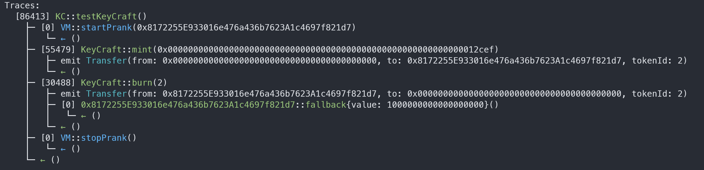

# KeyCraft

## Objective of CTF

You are provided with 0 ether. After the hack you should have 1 ether.

### Instructions:

Paste your address in place of <Your Address> in the setUp() function
Give your solution in //Solution marked space in testKeyCraft() function.

## Analysis

### Attack steps:

1. Mint a token with parameter 'b'.
2. Burn it to obtain 1 ETH.

### How to bypass the `checkAddress` modifier and mint a token?

1. Use a for loop to find an `i` value for which the `hash(i)` equals 13057 after performing the following operations, then choose the `i` as our value `b`:
    - shift left by **108** bits
    - shift right by **240** bits
    - shift left by **240** bits
2. Set `address(hash(b))` as our attacker address.
3. Call the `mint()` function with parameter `b`

