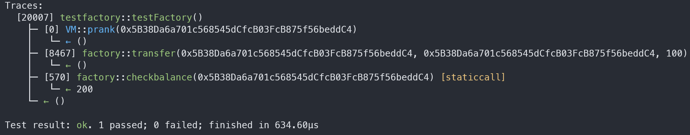

# TemporaryVariable

## Objective of CTF

Your goal is to exploit a vulnerability in the contract to remove exactly double the amount you supply. Provide your solution as user1 that supplies 100 units to the contract and removes 200 units . Use the foundry setup given below.

## Vulnerability Describe

In the `transfer()` function, it uses a temporary variable to calculate the user's balance. However, this could cause inconsistencies with the actual balance of the user. Additionally, we notice that the `transfer()` function does not restrict users from transferring assets to themselves.

Therefore, we exploit this vulnerability to let user1 to transfer assets to themselves.

The `transfer()` function updates the user's balance using the following code snippet:

```code=solidity
_balances[_from] = frombalance - _amount;
_balances[_to] = tobalance + _amount;
```

In this situation, the balance of user1 is determined by the last line of code, that is, the original balance of user1 plus `amount` value. This could make user1's balance double to the original balance.


